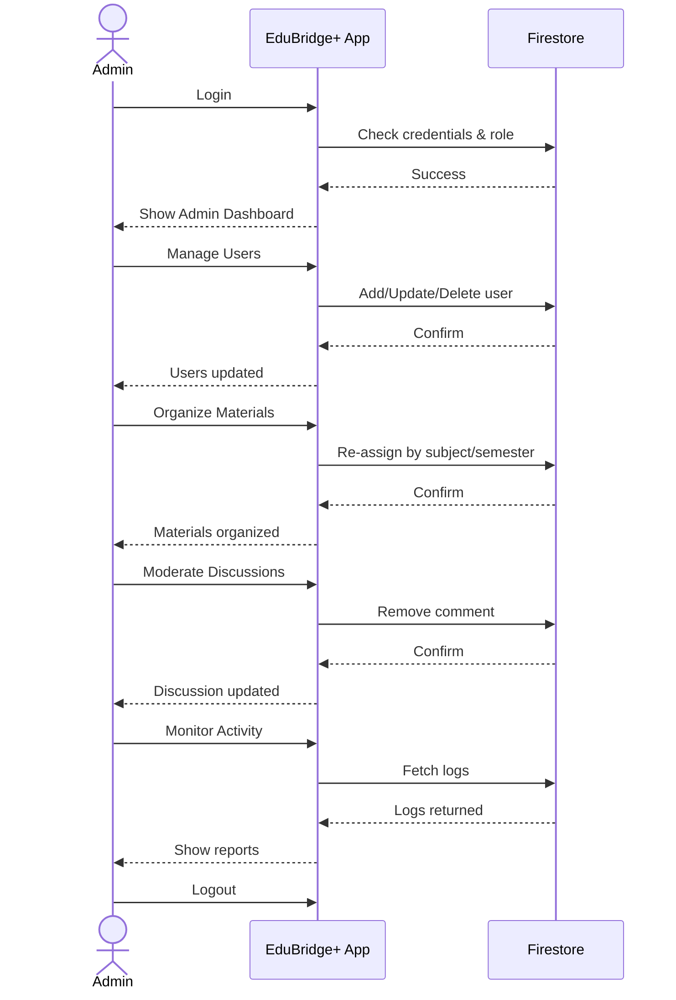

```mermaid
sequenceDiagram
    actor Admin
    participant WebApp as EduBridge+ App
    participant DB as Firestore

    Admin->>WebApp: Login
    WebApp->>DB: Check credentials & role
    DB-->>WebApp: Success
    WebApp-->>Admin: Show Admin Dashboard

    Admin->>WebApp: Manage Users
    WebApp->>DB: Add/Update/Delete user
    DB-->>WebApp: Confirm
    WebApp-->>Admin: Users updated

    Admin->>WebApp: Organize Materials
    WebApp->>DB: Re-assign by subject/semester
    DB-->>WebApp: Confirm
    WebApp-->>Admin: Materials organized

    Admin->>WebApp: Moderate Discussions
    WebApp->>DB: Remove comment
    DB-->>WebApp: Confirm
    WebApp-->>Admin: Discussion updated

    Admin->>WebApp: Monitor Activity
    WebApp->>DB: Fetch logs
    DB-->>WebApp: Logs returned
    WebApp-->>Admin: Show reports

    Admin->>WebApp: Logout
```
