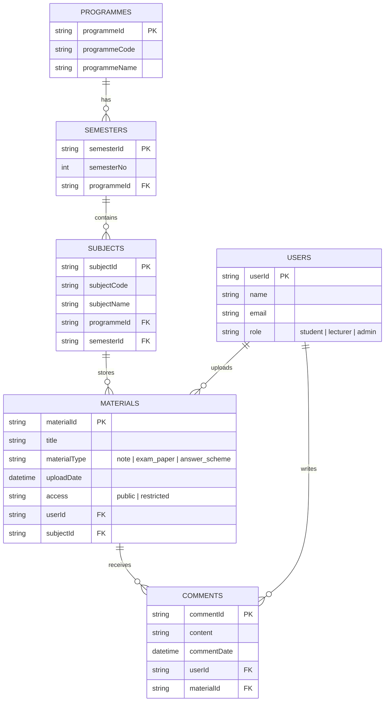

```mermaid
erDiagram
    USERS {
        string userId PK
        string name
        string email
        string role  "student | lecturer | admin"
    }

    PROGRAMMES {
        string programmeId PK
        string programmeCode
        string programmeName
    }

    SEMESTERS {
        string semesterId PK
        int semesterNo
        string programmeId FK
    }

    SUBJECTS {
        string subjectId PK
        string subjectCode
        string subjectName
        string programmeId FK
        string semesterId FK
    }

    MATERIALS {
        string materialId PK
        string title
        string materialType "note | exam_paper | answer_scheme"
        datetime uploadDate
        string access "public | restricted"
        string userId FK
        string subjectId FK
    }

    COMMENTS {
        string commentId PK
        string content
        datetime commentDate
        string userId FK
        string materialId FK
    }

    %% Relationships (Firestore style: collections / subcollections)
    PROGRAMMES ||--o{ SEMESTERS : "has"
    SEMESTERS ||--o{ SUBJECTS : "contains"
    SUBJECTS ||--o{ MATERIALS : "stores"
    MATERIALS ||--o{ COMMENTS : "receives"

    USERS ||--o{ MATERIALS : "uploads"
    USERS ||--o{ COMMENTS : "writes"
```
