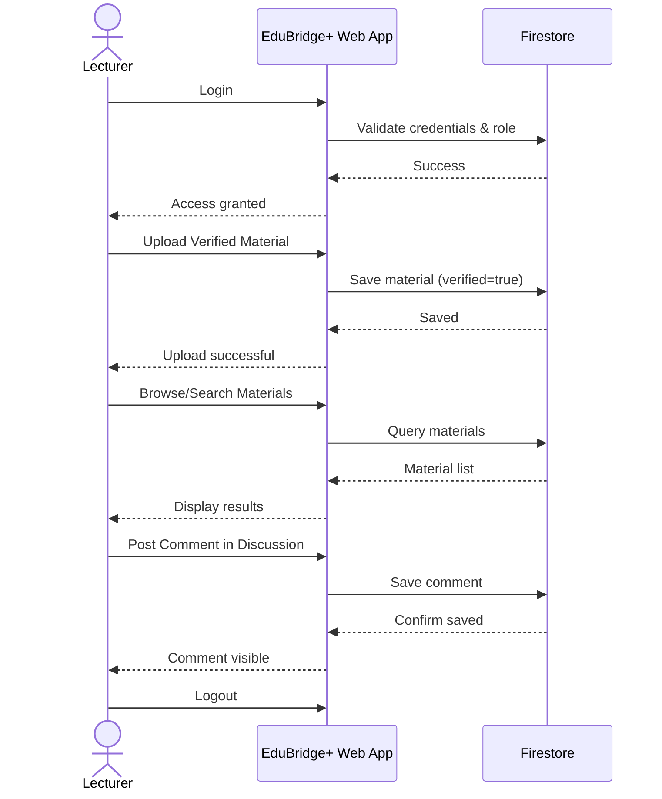

```mermaid
sequenceDiagram
    actor Lecturer
    participant WebApp as EduBridge+ Web App
    participant DB as Firestore

    Lecturer->>WebApp: Login
    WebApp->>DB: Validate credentials & role
    DB-->>WebApp: Success
    WebApp-->>Lecturer: Access granted

    Lecturer->>WebApp: Upload Verified Material
    WebApp->>DB: Save material (verified=true)
    DB-->>WebApp: Saved
    WebApp-->>Lecturer: Upload successful

    Lecturer->>WebApp: Browse/Search Materials
    WebApp->>DB: Query materials
    DB-->>WebApp: Material list
    WebApp-->>Lecturer: Display results

    Lecturer->>WebApp: Post Comment in Discussion
    WebApp->>DB: Save comment
    DB-->>WebApp: Confirm saved
    WebApp-->>Lecturer: Comment visible

    Lecturer->>WebApp: Logout
```
