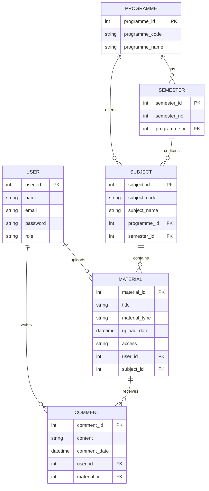

```mermaid
erDiagram
    USER {
        int user_id PK
        string name
        string email
        string password
        string role
    }
    PROGRAMME {
        int programme_id PK
        string programme_code
        string programme_name
    }
    SEMESTER {
        int semester_id PK
        int semester_no
        int programme_id FK
    }
    SUBJECT {
        int subject_id PK
        string subject_code
        string subject_name
        int programme_id FK
        int semester_id FK
    }
    MATERIAL {
        int material_id PK
        string title
        string material_type
        datetime upload_date
        string access
        int user_id FK
        int subject_id FK
    }
    COMMENT {
        int comment_id PK
        string content
        datetime comment_date
        int user_id FK
        int material_id FK
    }

    USER ||--o{ MATERIAL : "uploads"
    USER ||--o{ COMMENT : "writes"
    PROGRAMME ||--o{ SEMESTER : "has"
    PROGRAMME ||--o{ SUBJECT : "offers"
    SEMESTER ||--o{ SUBJECT : "contains"
    SUBJECT ||--o{ MATERIAL : "contains"
    MATERIAL ||--o{ COMMENT : "receives"
```
