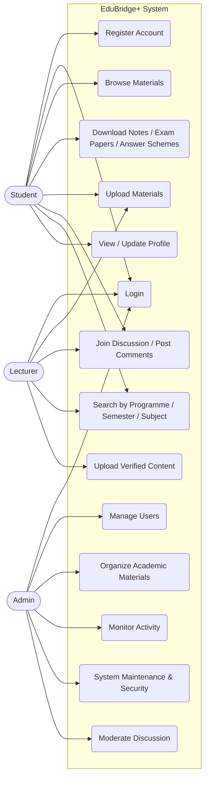

```mermaid
flowchart LR
    %% Actors
    Student([Student])
    Lecturer([Lecturer])
    Admin([Admin])

    %% System boundary
    subgraph EduBridge+ [EduBridge+ System]
        UC1(Register Account)
        UC2(Login)
        UC3(Browse Materials)
        UC4(Download Notes / Exam Papers / Answer Schemes)
        UC5(Upload Materials)
        UC6(Join Discussion / Post Comments)
        UC7(Search by Programme / Semester / Subject)
        UC8(View / Update Profile)

        UC9(Moderate Discussion)
        UC10(Upload Verified Content)

        UC11(Manage Users)
        UC12(Organize Academic Materials)
        UC13(Monitor Activity)
        UC14(System Maintenance & Security)
    end

    %% Relationships
    Student --> UC1
    Student --> UC2
    Student --> UC3
    Student --> UC4
    Student --> UC5
    Student --> UC6
    Student --> UC7
    Student --> UC8

    Lecturer --> UC2
    Lecturer --> UC5
    Lecturer --> UC6
    Lecturer --> UC7
    Lecturer --> UC10

    Admin --> UC2
    Admin --> UC11
    Admin --> UC12
    Admin --> UC13
    Admin --> UC14
    Admin --> UC9


```
