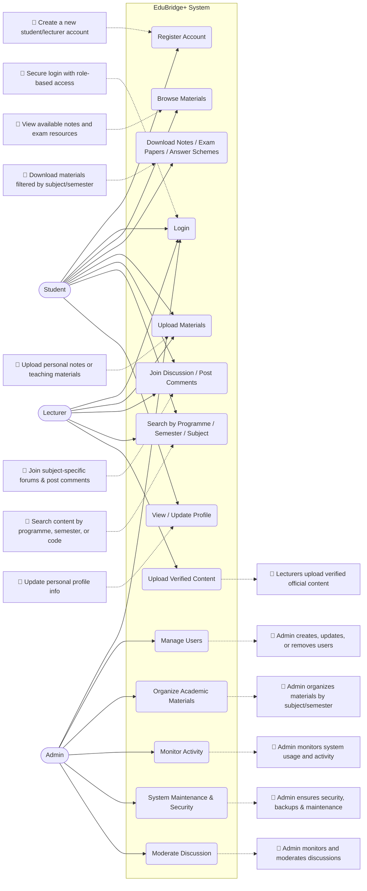

```mermaid
flowchart LR
    %% Actors
    Student([Student])
    Lecturer([Lecturer])
    Admin([Admin])

    %% System boundary
    subgraph EduBridge+ [EduBridge+ System]
        UC1(Register Account)
        UC2(Login)
        UC3(Browse Materials)
        UC4(Download Notes / Exam Papers / Answer Schemes)
        UC5(Upload Materials)
        UC6(Join Discussion / Post Comments)
        UC7(Search by Programme / Semester / Subject)
        UC8(View / Update Profile)

        UC9(Moderate Discussion)
        UC10(Upload Verified Content)

        UC11(Manage Users)
        UC12(Organize Academic Materials)
        UC13(Monitor Activity)
        UC14(System Maintenance & Security)
    end

    %% Relationships
    Student --> UC1
    Student --> UC2
    Student --> UC3
    Student --> UC4
    Student --> UC5
    Student --> UC6
    Student --> UC7
    Student --> UC8

    Lecturer --> UC2
    Lecturer --> UC5
    Lecturer --> UC6
    Lecturer --> UC7
    Lecturer --> UC10

    Admin --> UC2
    Admin --> UC11
    Admin --> UC12
    Admin --> UC13
    Admin --> UC14
    Admin --> UC9

    %% Notes (left side, mostly student use cases)
    NoteUC1["📝 Create a new student/lecturer account"] -.-> UC1
    NoteUC2["📝 Secure login with role-based access"] -.-> UC2
    NoteUC3["📝 View available notes and exam resources"] -.-> UC3
    NoteUC4["📝 Download materials filtered by subject/semester"] -.-> UC4
    NoteUC5["📝 Upload personal notes or teaching materials"] -.-> UC5
    NoteUC6["📝 Join subject-specific forums & post comments"] -.-> UC6
    NoteUC7["📝 Search content by programme, semester, or code"] -.-> UC7
    NoteUC8["📝 Update personal profile info"] -.-> UC8

    %% Notes (right side, lecturer/admin use cases)
    UC9 -.-> NoteUC9["📝 Admin monitors and moderates discussions"]
    UC10 -.-> NoteUC10["📝 Lecturers upload verified official content"]
    UC11 -.-> NoteUC11["📝 Admin creates, updates, or removes users"]
    UC12 -.-> NoteUC12["📝 Admin organizes materials by subject/semester"]
    UC13 -.-> NoteUC13["📝 Admin monitors system usage and activity"]
    UC14 -.-> NoteUC14["📝 Admin ensures security, backups & maintenance"]
```
