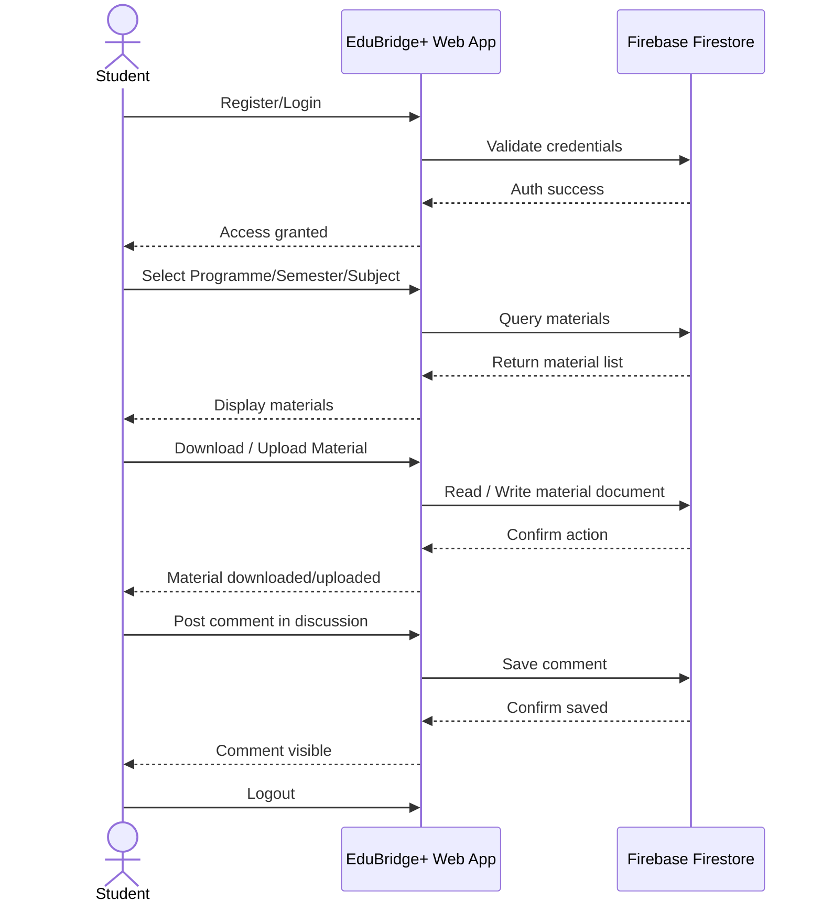

```mermaid
sequenceDiagram
    actor Student
    participant WebApp as EduBridge+ Web App
    participant DB as Firebase Firestore

    Student->>WebApp: Register/Login
    WebApp->>DB: Validate credentials
    DB-->>WebApp: Auth success
    WebApp-->>Student: Access granted

    Student->>WebApp: Select Programme/Semester/Subject
    WebApp->>DB: Query materials
    DB-->>WebApp: Return material list
    WebApp-->>Student: Display materials

    Student->>WebApp: Download / Upload Material
    WebApp->>DB: Read / Write material document
    DB-->>WebApp: Confirm action
    WebApp-->>Student: Material downloaded/uploaded

    Student->>WebApp: Post comment in discussion
    WebApp->>DB: Save comment
    DB-->>WebApp: Confirm saved
    WebApp-->>Student: Comment visible

    Student->>WebApp: Logout
```
